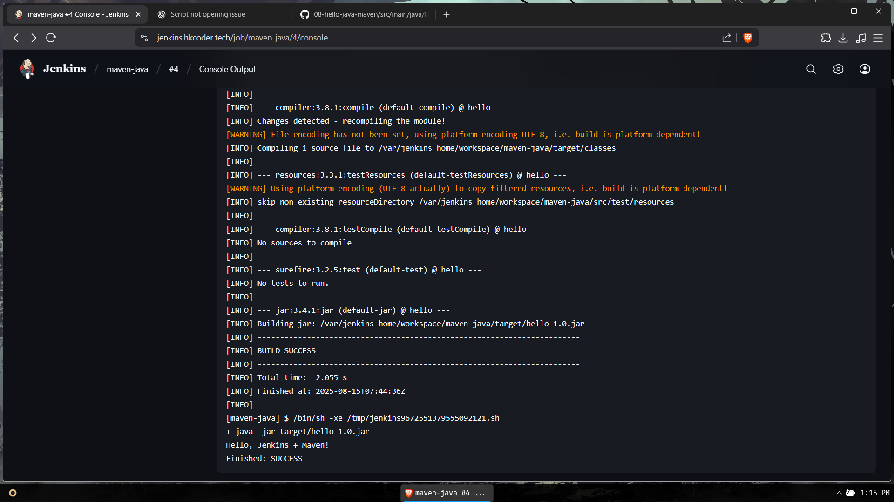

# Hello Java Maven - Jenkins Task

## 📌 Description
A simple Java HelloWorld application built with Maven and executed via Jenkins.

## 🛠 Steps to Run in Jenkins
1. Start Jenkins (via Docker or local install).
2. Configure Maven in **Manage Jenkins → Global Tool Configuration**.
3. Create a **Freestyle Project**.
4. Set build step to **Invoke top-level Maven targets** with goal `clean package`.
5. Build the job and check for **BUILD SUCCESS**.

## 📂 Project Structure
```
hello-java-maven/
 ├── src/main/java/HelloWorld.java
 └── pom.xml
```

## ✅ Output
```
Hello, Jenkins + Maven!
```
## Screenshots
 
